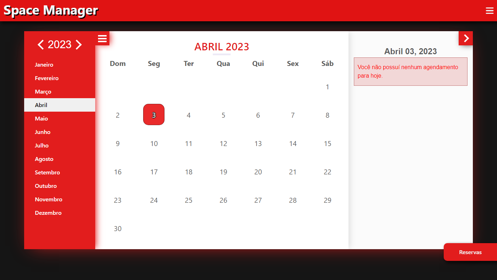

# Space Manager

## 📖 Sobre o projeto

Este é o Sistema Space Manager, um gerenciador de espaços online cujo o foco principal é facilitar a organização dos espaços escolares, onde cada professor que queira agendar um dia ou horário para dar aula em um espaço que não seja uma sala de aula possa realizar essa programação.

O projeto foi desenvolvido como um Trabalho de Conclusão de Curso (TCC) do curso de Informática Para Internet da ETEC Antônio Furlan, em 2022.

## 👥 Membros do projeto

- André Almeida
- Brendha Cristina
- Gerson Silva
- Gustavo Sales
- Valdir Machado

## 📝 Funcionalidades

Ao utilizar o Space Manager, a escola recebe uma aplicação web, um RM e SENHA para fazer o primeiro login, podendo acessar através do link, podendo cadastrar novos usuários e administradores.

O usuário comum, seja um professor ou coordenador, pode realizar a reserva de horário de um espaço específico para dar aulas. Nosso sistema tende a facilitar o processo de agendamento e organização das reservas, sendo mais rápido e mais prático para que um professor possa utilizar de um espaço diferente para lecionar para seus alunos.

O administrador tem acesso a todas as reservas dos usuários, acesso a lista de usuários cadastrados no sistema e lista de espaços reservados, podendo assim acrescentar, desativar usuários ou excluir registros dos mesmos. 

Um coordenador tem acesso a lista de todas as reservas dos usuários, pode criar uma reserva e também excluir agendamentos.

## 💌 Dedicatória

Dedicamos este projeto a todos que fizeram parte de nossa jornada, companheiros que nos deram assistência e apoio nos momentos necessários.

Em especial, dedicamos ao nosso querido Marcelo Pelaes, o professor responsável por nos apresentar a programação, dandos as primeiras dicas que utilizamos até hoje, conselhos que nunca esqueceremos e um ombro amigo sempre que precisávamos, ele sempre esteve disposto a tirar todas as dúvidas, um excelente profissional que infelizmente nos deixou cedo, mas segue eternamente em nossas memórias, tivemos célebres períodos em conjunto aos quais sempre serão lembrados com muito carinho.
