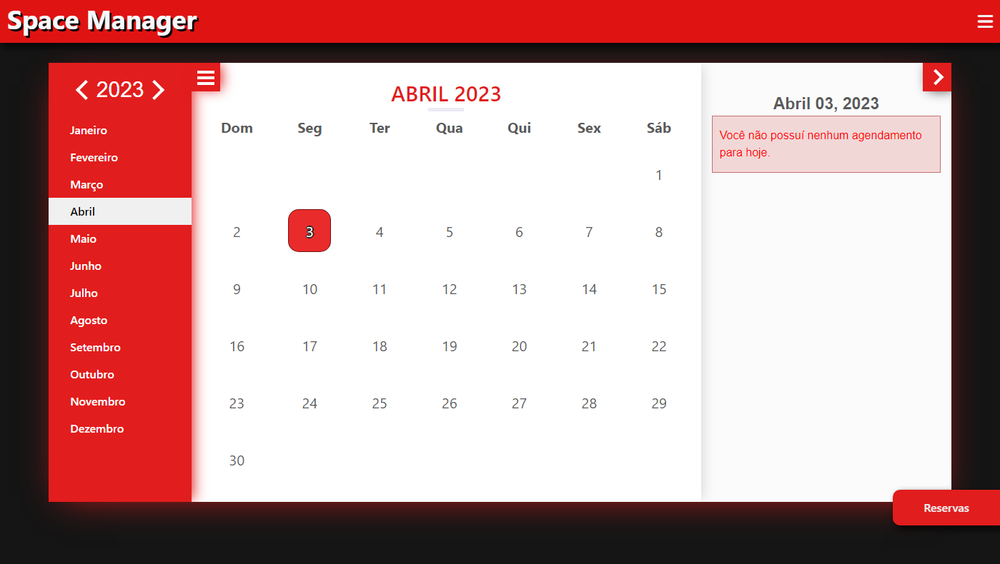

# Space Manager

## 📖 Info

Este é o Sistema Space Manager, um gerenciador de espaços online cujo o foco principal é facilitar a organização dos espaços escolares, onde cada professor que queira agendar um dia ou horário para dar aula em um espaço que não seja uma sala de aula possa realizar essa programação.

  

## 👥 Membros do projeto

- André Almeida
- Brendha Cristina
- Gerson Silva
- Gustavo Sales
- Valdir Machado

 

## 🚀 Tecnologias

O projeto foi desenvolvido utilizando as seguintes tecnologias:

### Frontend

- HTML
- CSS
- Javascript

#### Frontend libs

- <a href="https://getbootstrap.com/"> Bootstrap </a>
- <a href="https://edlynvillegas.github.io/evo-calendar/"> Evocalendar </a>

### Backend

- Node Js
- MySQL

#### Backend Dependencies

- NPM
- Bcrypt
- Body Parser
- Cors
- Express
- Json Web Token
- Mysql2
- Nodemon
- Nodemailer
- Sequelize

### Outros

- Git e Github
- Figma
- Visual Studio Code

 

## 🚀 Setup and Run Code 

1. Primeiramente, indico utilizar o <a href="https://code.visualstudio.com/"> Visual Studio Code </a> para poder editar e abrir o projeto. E, para poder visualizar o banco de dados utilizado, também indico usar o <a href="https://www.apachefriends.org/pt_br/download.html"> Xampp</a>;

2. Logo após, abra o Space Manager no Terminal Integrado do VS Code ou o Prompt de Comando e digite os seguintes comandos:

> cd api

> npm install

> npm run dev

 

3. Faça a importação do banco de dados, localizado em: _api/database/smdb.sql_

4. Em seu VS Code, navegue até a pasta _client_, clique com o botão direito em cima do _index.html_ e selecione _Abrir com o Live Server | Open with Live Server_, uma guia de seu navegador irá se abrir com a tela de login do sistema aberta.

5. Para ter acesso ao sistema, basta fazer login com o seguinte RM e SENHA:
> RM: 0

> Senha: 12345